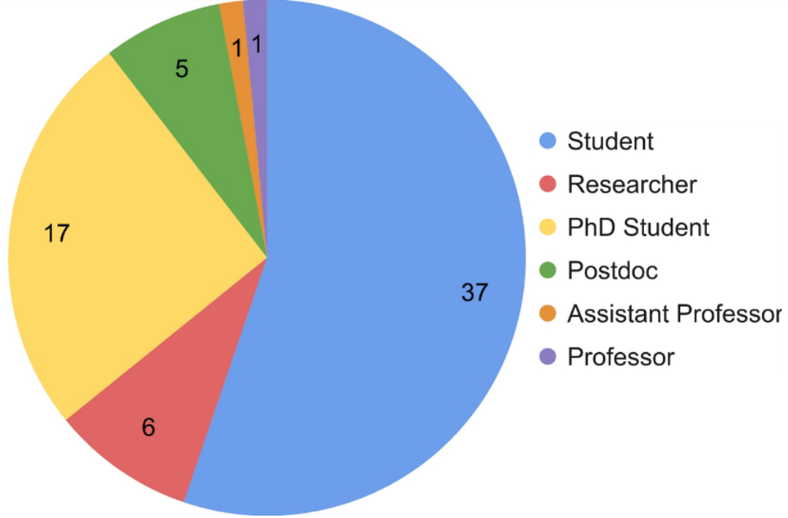

_More than 60 participants attended three days of lectures and practical hands-on sessions._

<!--more-->

A wide variety of topics were covered at the [**Atomistic Modelling School 2025** (**AMS25**)](/teaching/ams25):
_ab initio_ density functional theory, electron-phonon interactions, classical force-fields,
quantum transport and machine-learning, to name a few.
The participants also had the opportunity to get first-hand practical experience in
performing simulations on their own machines.

The teaching resources we created for AMS25 are free and publicly available:

- [Lecture slides](https://github.com/rbi-mtm/ams25_lectures)
- [Installation instructions and exercises](https://github.com/rbi-mtm/ams) for the hands-on sessions,
including a virtual machine with preinstalled software

We were delighted to see such strong interest in the school.

We are especially proud that **more than 50%** of the participants were
**undergraduate students**. We hope that we have provided them not only with
technical knowledge, but also with insights into professional research
and an opportunity to interact with researchers at different career stages.
The future of atomistic simulations in Croatia looks bright!

Finally, we thank the [Institute of Physics](https://ifs.hr/e/n/) for co-organizing **AMS25**,
providing the lecture hall and organizing the coffee breaks.

We hope that **AMS25** marks the beginning of a long-standing tradition. See you at **AMS2X**!
